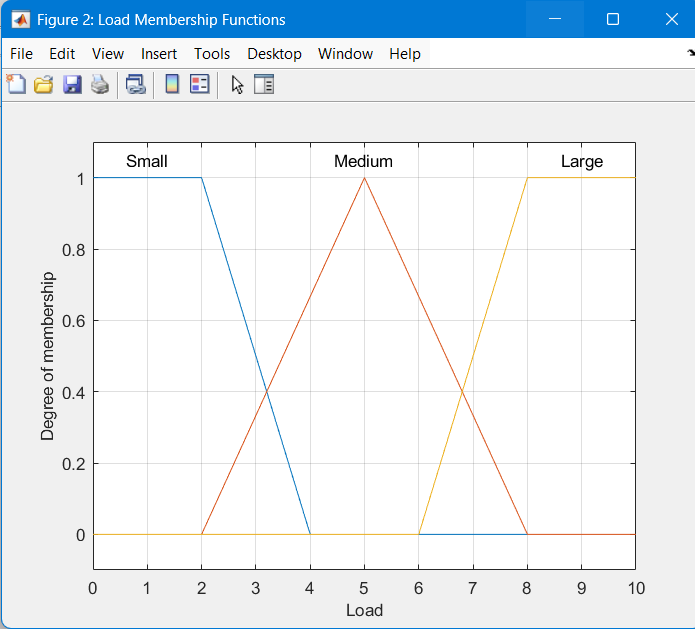
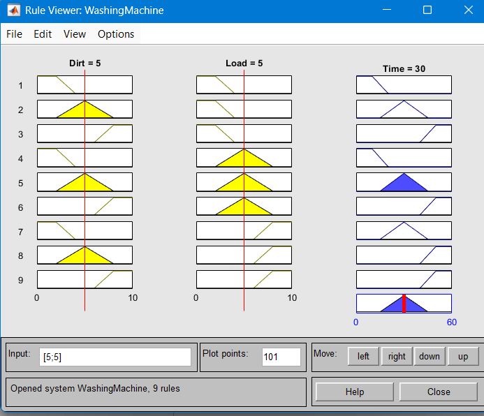
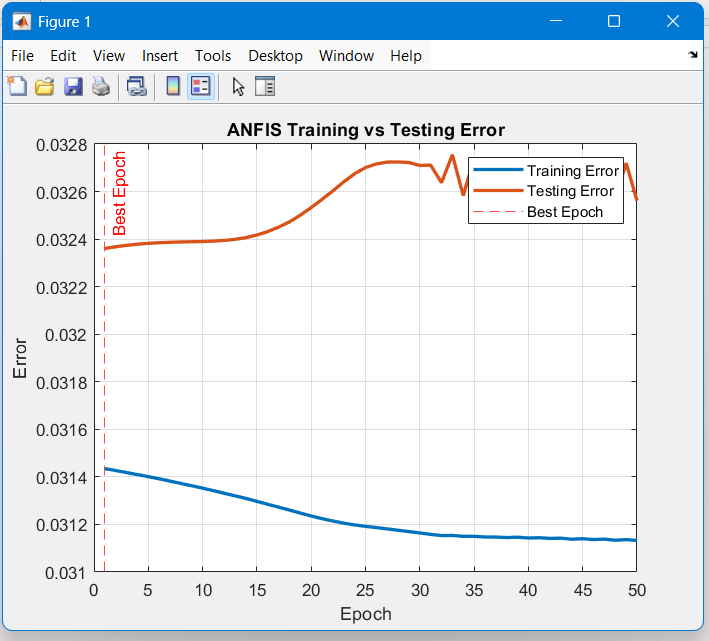
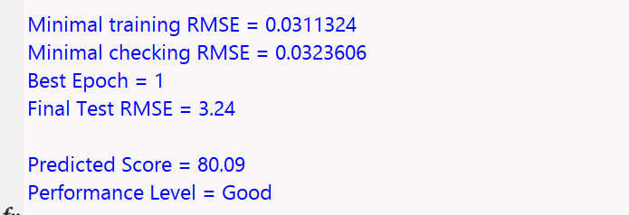

#  Fuzzy Logic + ANFIS Intelligent System

##  Overview

This project implements:

* A fuzzy logic system for washing machine cycle time
* An ANFIS model to predict student performance

---

##  Q1: Washing Machine (Fuzzy Logic)

### Inputs:

* Dirt Level
* Load Size

### Output:

* Washing Time

### Features:

* Membership functions (Low, Medium, High)
* Rule-based system
* MATLAB Fuzzy Logic Toolbox

---

##  Q2: Student Performance Prediction (ANFIS)

### Inputs:

* Attendance
* Assignment Marks
* Test Marks

### Output:

* Performance Level (Poor / Average / Good)

---

##  Methodology

* Dataset: 1000 students
* Normalization applied
* Train-Test Split (80-20)
* ANFIS training with validation
* Early stopping to prevent overfitting

---

##  Results

* Training RMSE ≈ 0.03
* Testing RMSE ≈ 0.03–0.035
* Best Epoch ≈ 20

---

##  Sample Output

Predicted Score = 80
Performance Level = Good

---

##  Project Structure

Q1_Fuzzy/
Q2_ANFIS/
dataset/
screenshots/
report/

---

##  Screenshots

### Q1: Fuzzy Logic

---

### Q2: ANFIS

---

##  Tools Used

* MATLAB
* Fuzzy Logic Toolbox
* ANFIS

---

##  Author

Sumit Gareri 

